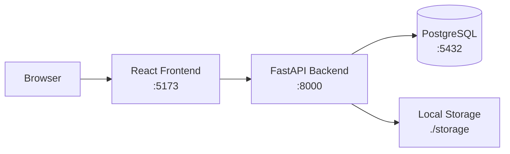

## galley

### Ebook Publishing Platform

Galley is an ebook store and sample distribution platform for self-published and aspiring authors. Sell your work, share samples, build your readership.

### Tech Stack

- Python / FastAPI
- SQLAlchemy / PostgreSQL
- React / TypeScript / Tailwind

### Architecture



The backend is a REST API with JWT auth. The frontend is a Vite/React SPA that talks to it. Storage defaults to local disk and is designed to swap to S3 without touching the domain layer.

### Local Setup

Prerequisites: Docker, [uv](https://docs.astral.sh/uv/), Node.js

```bash
# Start the database and run migrations
make setup

# Start the backend
make run

# In another terminal, start the frontend
cd frontend && npm install && npm run dev
```

Copy `.env.example` → `.env` and `frontend/.env.example` → `frontend/.env` before starting. The defaults work out of the box against the Docker database.

### Running the Tests

```bash
make test
```

### Roadmap

See [galley-tickets](https://github.com/zrd/galley-tickets) for the full project board. High-level: public store API is done, frontend store views and acquisition flow are next.
