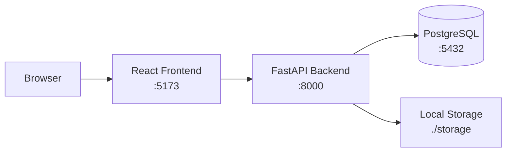
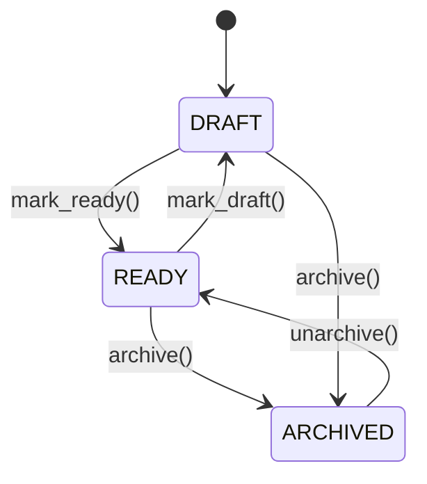

## galley

[](https://github.com/zrd/galley/actions/workflows/ci-backend.yml)
[](https://github.com/zrd/galley/actions/workflows/ci-frontend.yml)

### Ebook Publishing Platform

Galley is an ebook store and sample distribution platform for self-published and aspiring authors. Sell your work, share samples, build your readership.

### Tech Stack

- Python / FastAPI
- SQLAlchemy / PostgreSQL
- React / TypeScript / Tailwind

### Architecture


```mermaid
graph LR
    B[Browser] --> F[React Frontend<br/>:5173]
    F --> A[FastAPI Backend<br/>:8000]
    A --> D[(PostgreSQL<br/>:5432)]
    A --> S[Local Storage<br/>./storage]
```

The backend is a REST API with JWT auth. The frontend, a Vite/React SPA, demonstrates the basic functionality with a simple GUI. Storage defaults to the local disk and is designed to swap to S3 without touching the domain layer.

Internally, the backend is layered — API → Service → Domain → Repository, each with a single responsibility and no knowledge of the layers above it. See [`docs/architecture.md`](docs/architecture.md) for the full breakdown.

### Publishing Lifecycle

Manuscripts move through a guarded state machine that provides flexibility around a book's visibility and downloadability. Every transition is a domain method that enforces its own preconditions and raises a typed exception when violated:


```mermaid
stateDiagram-v2
    [*] --> DRAFT
    DRAFT --> READY: mark_ready()
    READY --> DRAFT: mark_draft()
    READY --> ARCHIVED: archive()
    DRAFT --> ARCHIVED: archive()
    ARCHIVED --> READY: unarchive()
```

Each ebook generated from a manuscript also carries its own independent visibility (`PRIVATE` / `UNLISTED` / `PUBLISHED`), gated by — but distinct from — the manuscript's state above. See [`docs/publishing_states.md`](docs/publishing_states.md) for the combined state table and the design decisions behind it (e.g. links are permanent once distributed; archiving withdraws a title from download while keeping its store listing).

### Local Setup

Prerequisites: Docker, [uv](https://docs.astral.sh/uv/), Node.js

```bash
# Start the database and run migrations
make setup

# Start the backend
make run

# In another terminal, start the frontend
cd frontend && npm install && npm run dev
```

Copy `.env.example` → `.env` and `frontend/.env.example` → `frontend/.env` before starting. The defaults work out of the box against the Docker database.

### Running the Tests

```bash
make test
```
